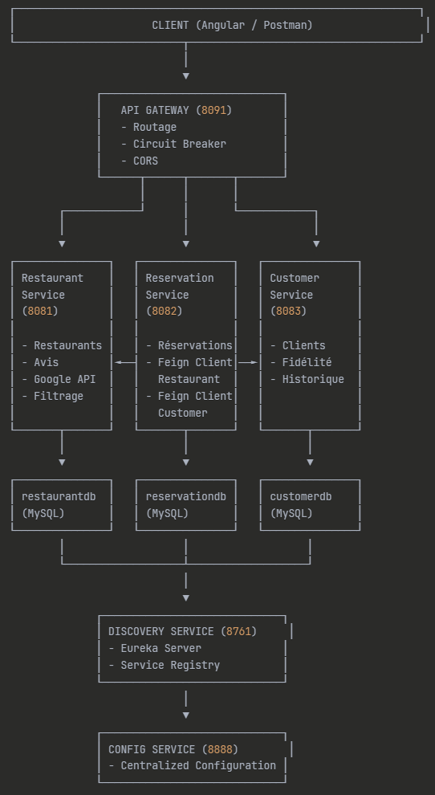

# reservation-restaurant-api
Application de réservation de restaurants développée avec Spring Boot intégrant les microservices (restaurant-service, reservation-service) et les clients REST (FeignClient, WebClient). Permet aux utilisateurs de trouver, réserver et noter des restaurants grâce à la géolocalisation et aux avis.

## 🧩 Architecture

Voici une vue globale du système. Ajoutez votre schéma dans `images/architecture.png`.

```md

```

Les services communiquent via **OpenFeign** et sont enregistrés auprès d’Eureka. Le routing externe passe par **Spring Cloud Gateway**.

---

## 🏗️ Microservices Breakdown

### **1. Discovery Service (Eureka Server)**

* **Port** : `8761`
* Gère la découverte dynamique des services.
* Fournit un registre où les services s’enregistrent.
* URL : `http://localhost:8761/`

Structure Maven :

```
discovery-service/
└── src/main/java/.../DiscoveryServiceApplication.java
```

### **2. Gateway Service**

* **Port** : `8091`
* Route automatiquement les requêtes vers les microservices en fonction de leur `serviceId`.
* Intègre les endpoints actuator : `/actuator/gateway/routes`.

Points clés :

* Basé sur `spring-cloud-gateway`
* Dépend de Eureka pour le service discovery

### **3. Config Server**

* Centralise la configuration.
* Format : `.yml`
* Peut pointer vers un repo Git distant ou local.

Exemple :

```
config-server/
└── src/main/resources/
    └── restaurant-service.yml
```

### **4. Restaurant Service**

* Gère : restaurants, capacité, horaires.
* Communique avec Customer Service et Reservation Service via Feign.
* **Port** : `8081`

Fonctionnalités :

* CRUD restaurants
* Vérification disponibilité

Exemple d’endpoint :

```
GET /restaurants
GET /restaurants/{id}
```

### **5. Customer Service**

* Gère les clients
* CRUD complet

Endpoints :

```
GET /customers
POST /customers
```

### **6. Reservation Service**

* Gère les réservations
* Parle avec restaurant-service + customer-service via Feign
* Utilise Resilience4J (circuit breaker + fallback)

Exemple :

```
POST /reservations
GET /reservations/{id}
```

---

## ⚙️ Technologies

* **Java 17**
* **Spring Boot 3.3.x**
* **Spring Cloud 2025.0.0**
* **Spring Cloud Gateway**
* **Spring Cloud OpenFeign**
* **Spring Cloud Config**
* **Eureka Discovery Server**
* **Resilience4J** (circuit breaker)
* **Hibernate / JPA / MySQL**
* **Lombok**
* **Maven**

---

## 📦 Project Structure

```
restaurant-reservation-system/
│
├── discovery-service/
├── config-server/
├── gateway-service/
├── restaurant-service/
├── customer-service/
└── reservation-service/
```

Tous les services utilisent :

```
src/main/resources/application.yml
src/main/java/.../Application.java
```

---

## 🔧 Installation & Execution

### 📌 Prérequis

* JDK 17+
* Maven 3.8+
* MySQL 8+

### 🛠️ 1. Cloner le projet

```
git clone https://github.com/your/repo.git
cd restaurant-reservation-system
```

### 🛠️ 2. Lancer les services **dans cet ordre**

#### 1) Config Server

```
cd config-server
mvn spring-boot:run
```

#### 2) Discovery Service

```
cd discovery-service
mvn spring-boot:run
```

#### 3) Gateway

```
cd gateway-service
mvn spring-boot:run
```

#### 4) Restaurant Service

```
cd restaurant-service
mvn spring-boot:run
```

#### 5) Customer Service

```
cd customer-service
mvn spring-boot:run
```

#### 6) Reservation Service

```
cd reservation-service
mvn spring-boot:run
```

---

## 🗄️ Database Setup

Chaque service propriétaire d’une base :

* restaurant-db
* customer-db
* reservation-db

Méthode d’init : ajouter vos scripts SQL dans :

```
service-name/src/main/resources/schema.sql
service-name/src/main/resources/data.sql
```

---

## 🔐 Configuration (Config Server)

Les fichiers `.yml` doivent suivre cette structure :

```
restaurant-service.yml
customer-service.yml
reservation-service.yml
```

Avec par exemple :

```yml
server:
  port: 8081
spring:
  datasource:
    url: jdbc:mysql://localhost:3306/restaurant-db
    username: root
    password: root
```

---

## 🔄 Communication Feign

Exemple d’un Feign Client :

```java
@FeignClient(name = "restaurant-service")
public interface RestaurantFeignClient {
    @GetMapping("/restaurants/{id}")
    RestaurantDto getRestaurant(@PathVariable Long id);
}
```

---

## 🧪 Test avec Postman

1. Gateway : `http://localhost:8091/`
2. Pour chaque service :

   * Via Gateway : `/restaurant/...`
   * Direct : `http://localhost:8081/...`

---

## 🛡️ Resilience4J Example

```java
@CircuitBreaker(name = "restaurantService", fallbackMethod = "fallback")
public ReservationDto createReservation(Request req) {
    return ...
}
```

Fallback :

```java
public ReservationDto fallback(Request req, Exception e) {
    throw new RuntimeException("Restaurant service unavailable");
}
```

---

## 📚 Roadmap

* [ ] Ajouter Keycloak pour auth
* [ ] Ajouter Grafana + Prometheus
* [ ] Dockerisation
* [ ] Tests unitaires & intégration
* [ ] UI React

---

## 📄 License

MIT License (personnalisable)

---

**N’hésite pas à ajouter ton schéma dans `/images` pour un rendu encore plus propre.**
